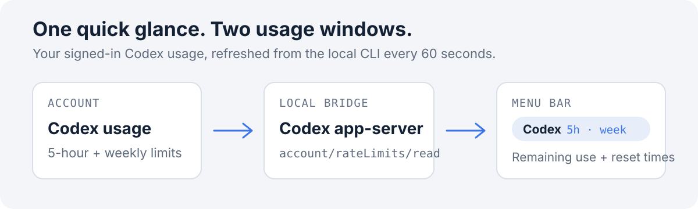

<p align="center">
  <a href="README.md">简体中文</a> · <strong><a href="README.en.md">English</a></strong>
</p>

<h1 align="center">Codex Usage Bar</h1>

<p align="center">See your Codex 5-hour and weekly usage, plus reset times, right from the macOS menu bar.</p>

<p align="center">macOS · Swift · MIT</p>

<p align="center">
  
</p>

Flow: account usage → local app-server → menu bar. Diagram is illustrative.

## Install

You need macOS, Xcode Command Line Tools, and the Codex CLI signed in to your account. Clone the repository and run:

```bash
git clone https://github.com/xibianyue2020/codex-usage-bar.git
cd codex-usage-bar
bash scripts/install.sh
```

The installer builds the menu bar app and registers it as a login item for your macOS user. Usage refreshes every minute. Open the menu to see reset times or refresh immediately.

## What you get

- Remaining percentages for the 5-hour and weekly usage windows in the menu bar.
- Reset times and the last refresh time in the menu.
- Manual refresh and quit actions.
- A standalone macOS menu bar app, with an optional Codex session-start hook.

## Data and privacy

The app asks the installed `codex app-server` for `account/rateLimits/read` and shows the usage windows returned for your signed-in Codex account. It does not read, copy, or store authentication tokens; requests are handled by the local Codex CLI.

## Uninstall

Run this from the repository directory:

```bash
bash scripts/uninstall.sh
```

This stops the app and removes its login item. The app and logs remain in `~/Library/Application Support/CodexUsageBar`; remove that directory separately for a full cleanup.

## Development

After editing the source, compile with Xcode Command Line Tools:

```bash
xcrun swiftc -O -framework AppKit -framework Foundation app/CodexUsageBar.swift -o /tmp/CodexUsageBar
```

## License

[MIT License](LICENSE)
