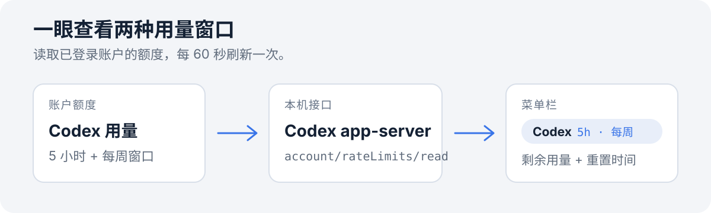

<p align="center">
  <strong><a href="README.md">简体中文</a></strong> · <a href="README.en.md">English</a>
</p>

<h1 align="center">Codex Usage Bar</h1>

<p align="center">把 Codex 5 小时与每周额度放进 macOS 菜单栏，随时查看剩余用量和重置时间。</p>

<p align="center">macOS · Swift · MIT</p>

<p align="center">
  
</p>

读取链路：账户额度 → 本机 app-server → 菜单栏；图中为流程示意。

## 快速安装

从 [GitHub Releases](https://github.com/xibianyue2020/codex-usage-bar/releases/latest) 下载最新的 `CodexUsageBar-…-universal.dmg`，打开后双击“安装 Codex Usage Bar.command”。应用支持 Apple 芯片和 Intel Mac，最低要求 macOS 13。首次打开如遇安全提示，请按住 Control 点按安装脚本并选择“打开”；如果应用没有出现在菜单栏，再从 Finder 的 `~/Applications` 中按住 Control 点按应用并选择“打开”。

也可以从源码安装：

需要 macOS、Xcode Command Line Tools 和已登录的 Codex CLI。克隆仓库后运行：

```bash
git clone https://github.com/xibianyue2020/codex-usage-bar.git
cd codex-usage-bar
bash scripts/install.sh
```

安装脚本会编译菜单栏应用，并将它加入当前 macOS 用户的登录项。安装后每分钟自动更新一次；点开菜单可查看重置时间或立即刷新。

## 能看到什么

- 菜单栏显示 5 小时和每周窗口的剩余百分比。
- 菜单中显示各额度的重置时间和最近更新时间。
- 支持手动刷新和退出。
- 菜单栏应用运行在 Codex 窗口之外；Codex 插件会话钩子可选启用。

## 数据来源与隐私

应用通过已安装的 `codex app-server` 请求 `account/rateLimits/read`，使用当前 Codex 登录账户返回的额度窗口。它不会读取、复制或保存认证令牌；请求由本机 Codex CLI 处理。

## 卸载

从源码安装的用户在仓库目录运行：

```bash
bash scripts/uninstall.sh
```

这会停止应用、移除登录项，并在存在时删除 `~/Applications/Codex Usage Bar.app`。编译出的程序、日志和支持文件保留在 `~/Library/Application Support/CodexUsageBar`；如需完全清理，请自行删除该目录。

## 开发

修改后可用 Xcode Command Line Tools 编译：

```bash
xcrun swiftc -O -framework AppKit -framework Foundation app/CodexUsageBar.swift -o /tmp/CodexUsageBar
```

## 许可

[MIT License](LICENSE)
